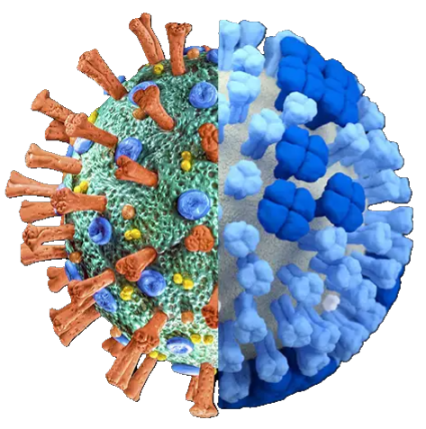
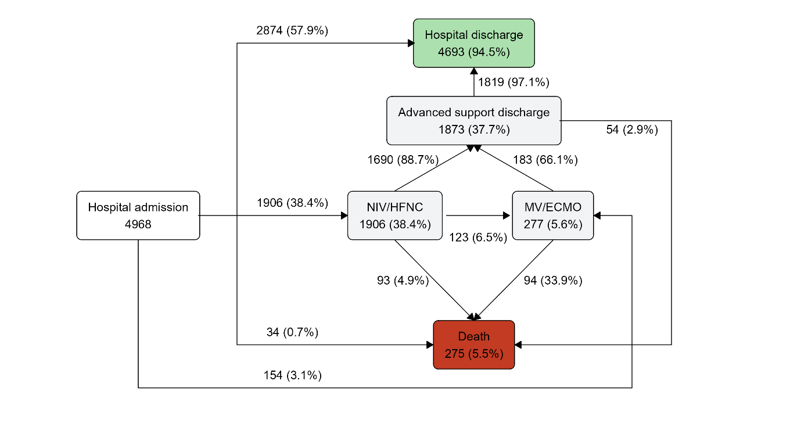
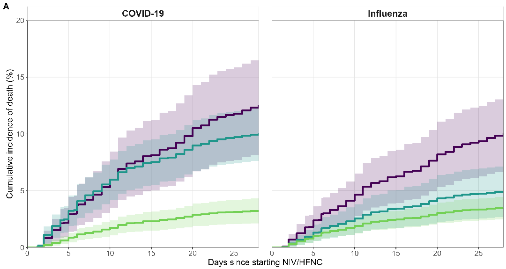
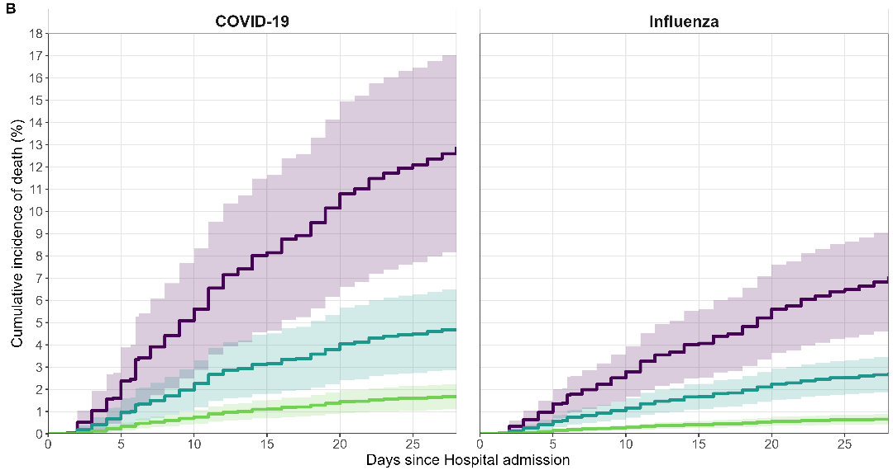
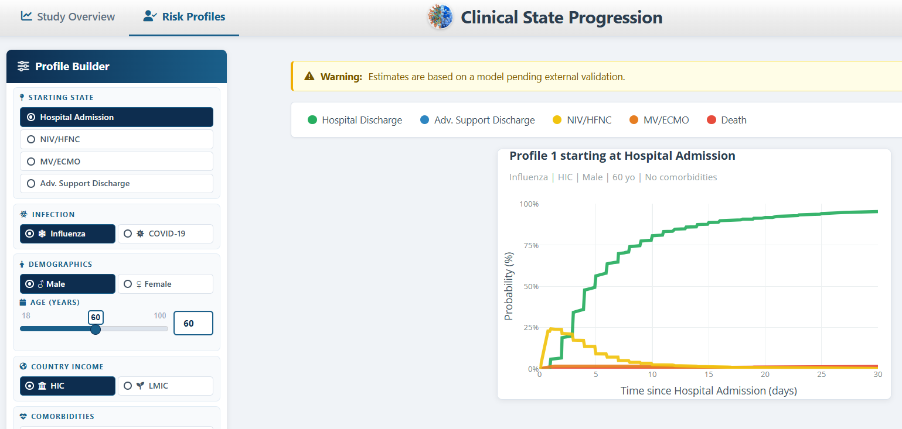
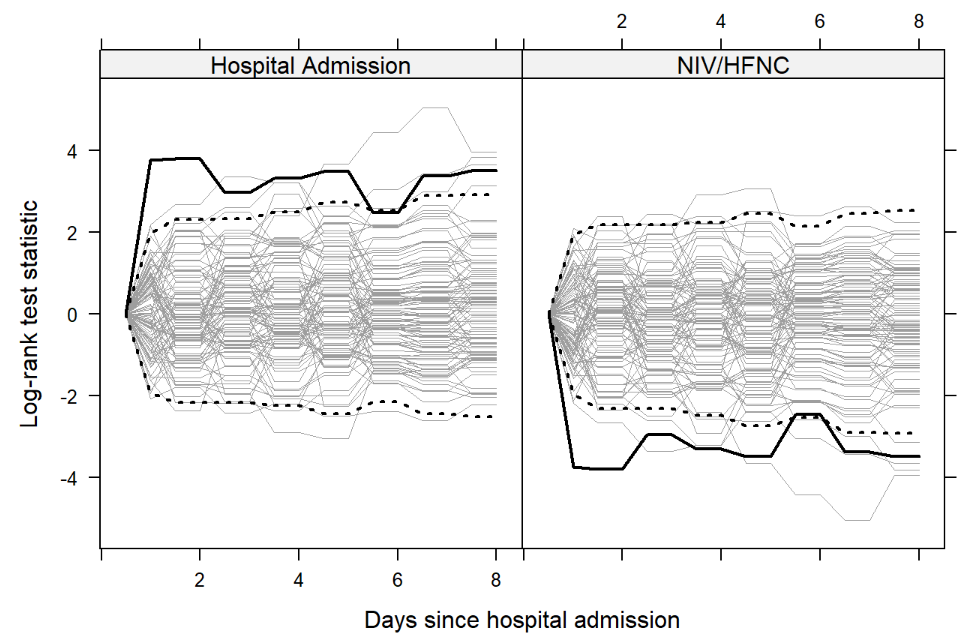
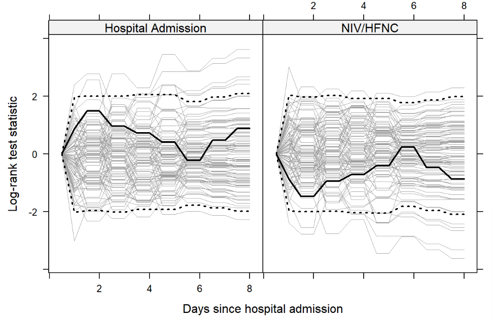

## About me {background-color="#ffffff"}

<span class="eyebrow">my path so far</span>

<div class="tl">
<div class="tl-item">
<div class="tl-dot"></div>
<div class="tl-when">2013 - 2018</div>
<div class="tl-what">BSc in Biology</div>
<div class="tl-where">Universidade do Porto</div>
</div>
<div class="tl-item">
<div class="tl-dot"></div>
<div class="tl-when">2018 - 2020</div>
<div class="tl-what">MSc in Biostatistics</div>
<div class="tl-where">Universitat de València</div>
</div>
<div class="tl-item">
<div class="tl-dot"></div>
<div class="tl-when">2021 - present</div>
<div class="tl-what">Biostatistician</div>
<div class="tl-where">Bellvitge Biomedical Research Institute (IDIBELL) &amp; Germans Trias i Pujol Research Institute and Hospital (IGTP)</div>
</div>
<div class="tl-item now">
<div class="tl-dot"></div>
<div class="tl-when">Dec 2025</div>
<div class="tl-what">PhD candidate <span class="tl-tag">officially started</span></div>
<div class="tl-where">Statistics &amp; Operations Research - UPC</div>
</div>
</div>

<div class="stat-row" style="margin-top:1.4em">
  <div class="stat"><div class="lab" style="margin-top:0">PhD focus</div><div style="font-size:.72em;margin-top:.35em">Multistate models beyond first-order Markov: clinical trajectories of hospitalised patients</div></div>
  <div class="stat accent"><div class="lab" style="margin-top:0">Day-to-day</div><div style="font-size:.72em;margin-top:.35em">Statistical support for clinical research; survival analysis; Shiny apps for prediction</div></div>
</div>

::: {.notes}
**[Title slide, ~20 s]** Good morning everyone, and thank you for coming. Today I want to tell you how we followed patients admitted to hospital with flu or COVID-19 step by step through their stay, and what that tells us about who needs respiratory support and who dies.

*[Next slide: About me]*

**[~1 min]** But first, a few words about me, since some of you may not know me yet.

*[Follow the timeline from left to right]* I started in your world: I studied biology at the University of Porto. Then I moved to statistics, with a master's in biostatistics in Valencia. Since 2021 I have worked as a biostatistician, first at IDIBELL and now here at the IGTP, supporting clinical and biomedical research projects. And in December 2025 I officially started my PhD at the UPC.

My PhD is about multistate models, which is exactly the type of model I am going to show you today. So this talk is both a real clinical study and a preview of what I will be working on in the coming years.
:::

## Index {.center background-color="#ffffff"}

<span class="eyebrow">running order</span>

<ul class="agenda" style="list-style:none">
<li data-n="01">Background &amp; objectives</li>
<li data-n="02">Methods: data and multistate models</li>
<li data-n="03">Results</li>
<li data-n="04">Checking the model: the Markov assumption</li>
<li data-n="05">Limitations &amp; future work</li>
<li data-n="06">Take-home messages</li>
</ul>

::: {.notes}
**[~20 s]** The plan is simple. I will start with the clinical problem and our objectives. Then I will introduce the data and the statistical idea, step by step. Then the results, a check of the model, and finally the limitations, next steps and take-home messages.
:::

## Background {background-color="#ffffff"}

<span class="eyebrow">acute respiratory infections</span>

::: {layout="[80,20]"}

- **Acute respiratory infections (ARIs)**, such as COVID-19 and influenza, cause seasonal challenges to healthcare systems worldwide, ranging from mild disease to life-threatening complications.



:::

::: {.callout-note appearance="simple"}
According to WHO estimates, approximately 116.5 million cases of COVID-19 were reported globally in 2023, and 3 to 5 million cases of severe influenza occur every year.
:::

- **Known prognostic factors**: age, sex, comorbidities (COPD, cardiovascular and chronic kidney disease) and country income, with higher ICU admission and in-hospital death in low- and middle-income countries.
- Hospitalisation for an ARI is a **multi-step process**: patients escalate through levels of respiratory support and recover, all within one admission. Predicting these steps is key to **anticipate hospital resources**.

::: {.notes}
**[~1.25 min]** Acute respiratory infections, such as COVID-19 and influenza, are a seasonal challenge for healthcare systems worldwide. They cover a very wide spectrum, from mild disease to life-threatening complications. *[Point to the box]* In 2023 alone, the WHO reported more than 116 million COVID-19 cases, and every year there are three to five million cases of severe influenza.

We already know quite well which patients are at higher risk: older patients, men, patients with chronic diseases such as COPD, heart or kidney disease, and also patients treated in low- and middle-income countries, who face a higher risk of ICU admission and in-hospital death.

But the key point for today is the last bullet. When one of these patients is admitted to hospital, what happens next is not a single event. It is a process with several steps. The patient may need oxygen through non-invasive ventilation or a high-flow nasal cannula; some progress to mechanical ventilation; many recover and come off support; and eventually they either go home or die. Being able to predict these steps is what allows hospitals to anticipate the resources they will need.
:::


## Objectives {background-color="#ffffff"}

<span class="eyebrow">what we wanted to find out</span>

- **Hypothesis**

    Clinical factors already known **at admission** (age, sex, comorbidities, where the patient is treated) predict the different steps of the clinical trajectory of patients hospitalised with an ARI.

- **Objectives**

    1. Measure how each factor affects **each step** of the hospital journey, not just the final outcome.
    2. Turn those results into easy-to-read **probabilities** and **risk profiles** (e.g. "chance of death within 28 days").
    3. Share the predictions through an **interactive web app**, to help hospitals anticipate **how much respiratory support they will need** (NIV/HFNC, MV/ECMO).

::: {.notes}
**[~1.25 min]** So this was our starting point. Our hypothesis is that clinical factors we already know when the patient is admitted, such as age, sex, chronic diseases and where the patient is treated, predict the different steps of the clinical trajectory.

From there, three objectives. First, to measure how each factor affects each step of the hospital journey, and not only the final outcome. Second, to translate those results into probabilities that are easy to read, for concrete risk profiles, for example the probability of death within 28 days. And third, to share these predictions through an interactive web application.

One important nuance about that application: it is meant to help hospitals anticipate how much respiratory support they will need, how many high-flow or ventilator beds, and not to decide how to treat one particular patient.
:::

# Methods {background-color="#ffffff" .center}

::: {.notes}
**[~10 s]** To answer these questions we need two things: data that capture the whole journey, and a model that can use them.
:::

## STRIVE Cohort {background-color="#ffffff"}

<br>

- International **prospective multicentre** observational cohort (FLU 003 Plus - NCT01056185).
- Run by the **INSIGHT** network within the *Strategies and Treatments for Respiratory Infections and Viral Emergencies* (**STRIVE**) group.
- **Inclusion**: adults (≥18 y) admitted to hospital with confirmed or suspected **influenza** or **COVID-19**, written informed consent.
- Recruitment: Influenza **2013-2024**, COVID-19 **2020-2024**.
- Collected: demographics, comorbidities, laboratory results, clinical outcomes, and **start/end dates of clinical states**.

<div class="stat-row">
  <div class="stat accent"><div class="num">13</div><div class="lab">countries</div></div>
  <div class="stat accent"><div class="num">69</div><div class="lab">sites</div></div>
  <div class="stat accent"><div class="num">5461</div><div class="lab">patients recruited</div></div>
  <div class="stat accent"><div class="num">2013-24</div><div class="lab">recruitment window</div></div>
</div>

::: {.notes}
**[~1 min]** Let me start with the data. They come from STRIVE, specifically from the FLU 003 Plus study: an international, prospective, observational cohort of adults admitted to hospital with flu or COVID-19. *[Point to the numbers]* It includes 69 hospitals in 13 countries and almost five and a half thousand patients. Flu patients were recruited from 2013 to 2024, and COVID-19 patients, logically, from 2020.

What makes this cohort special for us is the last bullet: for every patient we have the start and end dates of each clinical state. When high-flow started, when the patient was intubated, when support was withdrawn, and when the patient left hospital. That is what allows us to rebuild each patient's journey day by day.
:::

## From survival analysis to multistate models {background-color="#ffffff"}

<span class="eyebrow">the Cox model: one event</span>

:::: {.columns}
::: {.column width="40%"}
<br>
<svg viewBox="0 0 360 150" style="width:100%;max-width:330px;margin-top:30px" font-family="'IBM Plex Sans', sans-serif">
  <defs><marker id="bk" markerWidth="9" markerHeight="9" refX="7" refY="4.5" orient="auto"><path d="M0,0 L8,4.5 L0,9 z" fill="#8c3b4a"/></marker></defs>
  <rect x="14" y="54" width="120" height="44" rx="4" fill="#eef2f5" stroke="#33475e" stroke-width="2"/>
  <text x="74" y="81" font-size="14" font-weight="600" fill="#1f2d3d" text-anchor="middle">Admission</text>
  <line x1="136" y1="76" x2="212" y2="76" stroke="#8c3b4a" stroke-width="2.2" marker-end="url(#bk)"/>
  <rect x="216" y="54" width="120" height="44" rx="4" fill="#f6edee" stroke="#8c3b4a" stroke-width="2"/>
  <text x="276" y="81" font-size="14" font-weight="600" fill="#6e2c38" text-anchor="middle">Death</text>
</svg>
:::
::: {.column width="60%"}
$$h(t \mid X) \;=\; h_{0}(t)\,e^{\beta^{\top} X}$$

<hr></hr>

- $h(t \mid X)$: **hazard**, the instantaneous risk of the event at time $t$ for a patient with characteristics $X$.
- $h_{0}(t)$: **baseline hazard**, the risk for a reference patient.
- $e^{\beta}$: **hazard ratio (HR)**, how much a characteristic multiplies that risk.
- Appropriate when there is **a single event** of interest (e.g. death).
:::
::::

::: {.notes}
**[~1.75 min]** Now the model. To understand a multistate model it helps to start from a tool you have all seen, even if not by name: the Cox model.

*[Point to the diagram]* It considers one single event, for example going from admission to death. *[Point to the formula]* What it models is the hazard, h of t. The hazard is the instantaneous risk of the event: among the patients who are still alive at day t, how quickly are deaths happening right now. A useful image is a car's speedometer: the hazard is the speed at a given moment, not the distance you have already travelled.

The formula says that the hazard of a patient is a baseline hazard, the risk of a reference patient, multiplied by a factor that depends on the patient's characteristics. And that factor gives us the famous hazard ratio. A hazard ratio of 2 means that the risk is twice as high; a hazard ratio of 1 means no difference; and 0.5 means half the risk.

This works very well when there is one event of interest. But everything that happens between admission and that event stays in a black box.
:::

## One admission, many journeys {background-color="#ffffff"}

<span class="eyebrow">why a single endpoint is not enough</span>

<svg viewBox="0 0 1000 300" style="width:100%;margin-top:.4em" font-family="'IBM Plex Sans', sans-serif">
  <!-- axis -->
  <line x1="150" y1="262" x2="930" y2="262" stroke="#9aa7ac" stroke-width="1.5"/>
  <text x="150" y="285" font-size="15" fill="#6a7682">Day 0</text>
  <text x="930" y="285" font-size="15" fill="#6a7682" text-anchor="end">Day 28</text>
  <text x="540" y="285" font-size="15" fill="#6a7682" text-anchor="middle">days since admission →</text>
  <!-- Patient A -->
  <text x="20" y="52" font-size="18" font-weight="600" fill="#1f2d3d">Patient A</text>
  <rect x="150" y="30" width="170" height="34" rx="4" fill="#dfe5ea"/>
  <text x="235" y="53" font-size="14" fill="#33475e" text-anchor="middle">Admission</text>
  <rect x="324" y="30" width="118" height="34" rx="4" fill="#c8f0c8" stroke="#5a9a5a"/>
  <text x="383" y="53" font-size="14" fill="#2d6b2d" text-anchor="middle">Discharge</text>
  <!-- Patient B -->
  <text x="20" y="132" font-size="18" font-weight="600" fill="#1f2d3d">Patient B</text>
  <rect x="150" y="110" width="80" height="34" rx="4" fill="#dfe5ea"/>
  <text x="190" y="133" font-size="14" fill="#33475e" text-anchor="middle">Admission</text>
  <rect x="234" y="110" width="210" height="34" rx="4" fill="#e7d3a6"/>
  <text x="339" y="133" font-size="14" fill="#6b4c12" text-anchor="middle">NIV / HFNC</text>
  <rect x="448" y="110" width="170" height="34" rx="4" fill="#eef2f5" stroke="#9aa7ac"/>
  <text x="533" y="133" font-size="14" fill="#33475e" text-anchor="middle">Off Support</text>
  <rect x="622" y="110" width="118" height="34" rx="4" fill="#c8f0c8" stroke="#5a9a5a"/>
  <text x="681" y="133" font-size="14" fill="#2d6b2d" text-anchor="middle">Discharge</text>
  <!-- Patient C -->
  <text x="20" y="212" font-size="18" font-weight="600" fill="#1f2d3d">Patient C</text>
  <rect x="150" y="190" width="80" height="34" rx="4" fill="#dfe5ea"/>
  <text x="190" y="213" font-size="14" fill="#33475e" text-anchor="middle">Admission</text>
  <rect x="234" y="190" width="210" height="34" rx="4" fill="#e7d3a6"/>
  <text x="339" y="213" font-size="14" fill="#6b4c12" text-anchor="middle">NIV / HFNC</text>
  <rect x="448" y="190" width="140" height="34" rx="4" fill="#c9a0a8"/>
  <text x="523" y="213" font-size="14" fill="#fff" text-anchor="middle">MV / ECMO</text>
  <rect x="595" y="190" width="140" height="34" rx="4" fill="#eef2f5" stroke="#9aa7ac"/>
  <text x="665" y="213" font-size="14" fill="#33475e" text-anchor="middle">Off Support</text>
  <rect x="740" y="190" width="100" height="34" rx="4" fill="#cc3333"/>
  <text x="790" y="213" font-size="14" fill="#fff" text-anchor="middle">Death</text>
</svg>

:::: {.columns}
::: {.column width="50%"}
::: {.key}
**Classic survival analysis** looks only at the final state: *alive or dead, and when*.
:::
:::
::: {.column width="50%"}
::: {.key}
**A multistate model** uses the **whole path**: every step, its order and its timing.
:::
:::
::::

::: {.notes}
**[~1.5 min]** Let me show you what that black box hides, with three imaginary patients.

*[Point to Patient A]* Patient A is admitted and goes home a few days later, without any respiratory support. *[Patient B]* Patient B needs non-invasive ventilation or high-flow oxygen, which I will call NIV/HFNC from now on. Then support is withdrawn, the patient stays a few more days in hospital, and goes home. *[Patient C]* Patient C also starts on NIV/HFNC, then deteriorates and needs mechanical ventilation or ECMO, which I will call MV/ECMO. Support is eventually withdrawn, but the patient dies.

*[Point to left box]* A classic survival analysis, the kind behind most Kaplan-Meier curves and hazard ratios in clinical papers, looks only at the final state: patients A and B survived, patient C died, and when. Everything in the middle is lost.

*[Point to right box]* But clinically, and for hospital planning, what happens in the middle is exactly what matters: who needs high-flow, who needs a ventilator, for how long, and who recovers. A multistate model uses the whole path: every step, its order and its timing. Let me show you how it works.
:::


## The multistate model {background-color="#ffffff"}

<span class="eyebrow">one Cox model per transition</span>

:::: {.columns}
::: {.column width="38%"}
<br>
<svg viewBox="0 0 560 355" xmlns="http://www.w3.org/2000/svg" font-family="sans-serif" font-size="12" fill="#333">
<defs>
  <marker id="arr" markerWidth="8" markerHeight="6" refX="7" refY="3" orient="auto">
    <path d="M0,0 L8,3 L0,6 Z" fill="#666"/>
  </marker>
</defs>
<!-- Hospital discharge (green) -->
<rect x="285" y="10" width="150" height="38" rx="5" fill="#c8f0c8" stroke="#5a9a5a" stroke-width="1.5"/>
<text x="360" y="34" text-anchor="middle" fill="#2d6b2d">Hospital discharge</text>
<!-- Advanced support discharge -->
<rect x="285" y="88" width="150" height="42" rx="5" fill="white" stroke="#aaa" stroke-width="1.5"/>
<text x="360" y="106" text-anchor="middle">Advanced support</text>
<text x="360" y="122" text-anchor="middle">discharge</text>
<!-- Hospital admission -->
<rect x="10" y="172" width="140" height="38" rx="5" fill="white" stroke="#aaa" stroke-width="1.5"/>
<text x="80" y="196" text-anchor="middle">Hospital admission</text>
<!-- NIV/HFNC -->
<rect x="215" y="172" width="110" height="38" rx="5" fill="white" stroke="#aaa" stroke-width="1.5"/>
<text x="270" y="196" text-anchor="middle">NIV/HFNC</text>
<!-- MV/ECMO -->
<rect x="382" y="172" width="110" height="38" rx="5" fill="white" stroke="#aaa" stroke-width="1.5"/>
<text x="437" y="196" text-anchor="middle">MV/ECMO</text>
<!-- Death (red) -->
<rect x="310" y="282" width="100" height="42" rx="5" fill="#cc3333" stroke="#991111" stroke-width="1.5"/>
<text x="360" y="306" text-anchor="middle" fill="white">Death</text>
<!-- Arrows -->
<!-- admission → NIV/HFNC -->
<line x1="150" y1="191" x2="213" y2="191" stroke="#666" stroke-width="1.5" marker-end="url(#arr)"/>
<!-- admission → Hospital discharge (up then right) -->
<path d="M80,172 L80,29 L283,29" fill="none" stroke="#666" stroke-width="1.5" marker-end="url(#arr)"/>
<!-- admission → Death (down then right) -->
<path d="M80,210 L80,301 L310,301" fill="none" stroke="#666" stroke-width="1.5" marker-end="url(#arr)"/>
<!-- admission → MV/ECMO (direct) -->
<path d="M70,210 L70,340 L520,340 L520,191 L495,191" fill="none" stroke="#666" stroke-width="1.5" marker-end="url(#arr)"/>
<!-- NIV/HFNC → MV/ECMO -->
<line x1="325" y1="191" x2="380" y2="191" stroke="#666" stroke-width="1.5" marker-end="url(#arr)"/>
<!-- NIV/HFNC → Advanced support discharge -->
<line x1="290" y1="172" x2="326" y2="132" stroke="#666" stroke-width="1.5" marker-end="url(#arr)"/>
<!-- MV/ECMO → Advanced support discharge -->
<line x1="420" y1="172" x2="393" y2="132" stroke="#666" stroke-width="1.5" marker-end="url(#arr)"/>
<!-- NIV/HFNC → Death -->
<line x1="278" y1="210" x2="345" y2="280" stroke="#666" stroke-width="1.5" marker-end="url(#arr)"/>
<!-- MV/ECMO → Death -->
<line x1="437" y1="210" x2="375" y2="280" stroke="#666" stroke-width="1.5" marker-end="url(#arr)"/>
<!-- Advanced support discharge → Hospital discharge -->
<line x1="360" y1="88" x2="360" y2="50" stroke="#666" stroke-width="1.5" marker-end="url(#arr)"/>
<!-- Advanced support discharge → Death (down on the right) -->
<path d="M435,110 L530,110 L530,301 L410,301" fill="none" stroke="#666" stroke-width="1.5" marker-end="url(#arr)"/>
</svg>
<div class="cap" style="text-align:center;margin-top:.3em">Advanced support discharge = support withdrawn, patient still in hospital</div>
:::
::: {.column width="62%"}
$$h_{k}(t \mid X) \;=\; h_{0k}(t)\,e^{\beta_{k}^{\top} X}, \quad k = 1,\ldots,11$$

<hr></hr>

- **6 clinical states** and **11 possible transitions** between them.
- Each transition $k$ has its **own hazard** $h_k$, with its own baseline $h_{0k}$ and **its own covariate effects** $\beta_k$.
- A factor (e.g. age) can matter for **one transition** and not for another.
- Discharge and death are **absorbing states**.
- **Markov assumption**: the next transition depends only on the **current state**. *Tested later.*
:::
::::

::: {.notes}
**[~2.25 min]** This is how the multistate model opens the black box. *[Point to the diagram]* Instead of one event, we define six clinical states. Hospital admission. NIV/HFNC. MV/ECMO. Advanced support discharge, which simply means that respiratory support has been withdrawn but the patient is still in hospital. Hospital discharge. And death. Between these states there are eleven possible transitions, the lines you see in the diagram.

*[Point to the formula]* And here is the key idea: the formula is exactly the same Cox model, but written once for each transition, with an index k from 1 to 11. Each transition has its own baseline hazard and its own covariate effects. In other words, age does not have one effect: it has eleven, one for each transition. COPD, for example, is very important for the transition from admission to NIV/HFNC, and not for the transition from NIV/HFNC to death, as we will see. That is what allows us to see which factors matter at each step.

Hospital discharge and death are what we call absorbing states: once a patient gets there, they do not leave.

And finally, the model relies on one important assumption, the Markov assumption: the next transition depends only on the state the patient is in now, not on how the patient got there. Think of a board game: where you go next depends only on the square you are on, not on the squares you visited before. Please keep this in mind, because later we will check whether it is true.
:::

## From hazards to probabilities {background-color="#ffffff"}

<span class="eyebrow">how to read the results</span>

<div class="stat-row" style="margin-top:.6em">
<div class="stat">
<div class="lab" style="margin-top:0">1: Hazard ratio (HR) - one transition</div>
<div style="font-size:.76em;margin-top:.5em;line-height:1.4">Compares the risk of <b>one transition</b> between two groups.<br><br>
HR = 2 → twice the risk; HR = 1 → no difference; HR = 0.5 → half the risk</div>
</div>
<div class="stat accent">
<div class="lab" style="margin-top:0">2: State-occupation probability - all transitions</div>
<div style="font-size:.76em;margin-top:.5em;line-height:1.4">Combines <b>all 11 transition hazards</b> (Aalen-Johansen estimator) to answer:<br><br>
<i style="color:#92671c">"What is the probability that a patient like this has died by day 28?"</i></div>
</div>
</div>

$$\pi_j(t) \;=\; \Pr\{S(t)=j \mid S(0)=1\}$$

<div class="cap" style="text-align:center;margin-top:-.2em">probability of being in state j at day t, for a patient admitted at day 0 (state 1)</div>

- Calculated for **risk profiles** (disease, age, sex, comorbidities, country income), with **95% confidence intervals**.

::: {.notes}
**[~2.25 min]** Eleven transitions, each with up to seven hazard ratios, is a lot of numbers. So how do we turn this into something clinically useful? In the results you will see two kinds of numbers.

*[Left card]* The first is the hazard ratio. It refers to one single transition and compares the risk of that transition between two groups of patients, for example patients with and without COPD.

*[Right card]* The second, and the more useful one for clinicians, is the state-occupation probability. Here we combine all eleven transitions together, using what is called the Aalen-Johansen estimator. You can think of it as a bookkeeping system that, day by day, moves patients from one state to another according to the eleven hazards. The result answers questions like: what is the probability that a patient like this one has died by day 28?

*[Point to the formula]* The formula just says that: pi sub j of t is the probability of being in state j at day t, for a patient who was admitted at day zero. Going back to the car image: the hazard is the speed; the probability is where you are on the road at a given day.

We calculated these probabilities for risk profiles, that is, combinations of disease, age, sex, comorbidities and country income. And each one comes with a 95% confidence interval: a range of plausible values that tells us how precise the estimate is. The wider the interval, the less certain we are.
:::

## Statistical analysis {background-color="#ffffff"}

<span class="eyebrow">R - mstate</span>

- **Prognostic factors** chosen *a priori* with infectious-disease clinicians:
  disease (flu / COVID-19), age, sex, COPD, cardiovascular disease (CVD), chronic kidney disease (CKD), country income (HIC vs LMIC).
- **One Cox model stratified by transition**: a separate baseline hazard for each transition, and covariate effects specific to each transition. Time = days since admission.
- **Proportional hazards** checked (Schoenfeld residuals): when violated, the covariate was **stratified** in that transition; when events were too few, it was **omitted** from that transition.
- **Markov assumption** tested for each transition (Titman-Putter test).
- **Risk profiles**: all combinations with ≥5 patients and ≥1 event, ranked by the peak predicted probability within 28 days.
- All analyses in **R** (*mstate*); interactive **Shiny** app.

::: {.notes}
**[~2 min]** Putting it all together, this is what we did. The prognostic factors were chosen before looking at the data, together with the infectious disease clinicians: flu or COVID-19, age, sex, three major comorbidities, COPD, cardiovascular and chronic kidney disease, and the income level of the country where the hospital is, high-income versus low and middle-income. This last one captures differences in healthcare resources.

We fitted one single Cox model stratified by transition: in plain words, one model that estimates all eleven transitions at the same time, each with its own baseline and its own effects. Time was measured in days since admission.

The Cox model also assumes that the effect of each factor is constant over time: this is the proportional hazards assumption. We checked it for every factor and every transition. When it did not hold, we let that factor have its own baseline risk in that transition, which means we do not report a hazard ratio there, although it is still used to calculate the probabilities. And when a transition had too few events, the factor was left out of that transition.

We also tested the Markov assumption, and the risk profiles were ranked by their highest predicted probability within 28 days. Everything was done in R, and the results are available in an interactive application.
:::

# Results {background-color="#ffffff"}

::: {.notes}
**[~0 s]** Let us move to the results.
:::

## Flowchart {background-color="#ffffff"}

<div style="width:100%;max-width:1200px;margin:1em auto 0">
<svg viewBox="0 0 900 340" style="width:100%" font-family="'IBM Plex Sans', sans-serif">
  <defs>
    <marker id="fa" markerWidth="9" markerHeight="9" refX="7" refY="4.5" orient="auto">
      <path d="M0,0 L8,4.5 L0,9 z" fill="#33475e"/>
    </marker>
  </defs>
  <!-- Hospitalised patients -->
  <rect x="360" y="20" width="200" height="60" rx="4" fill="#eef2f5" stroke="#33475e" stroke-width="2.5"/>
  <text x="460" y="45" font-size="18" fill="#6a7682" text-anchor="middle">Hospitalised patients</text>
  <text x="460" y="70" font-family="'IBM Plex Mono', monospace" font-size="18" font-weight="600" fill="#1f2d3d" text-anchor="middle">5461</text>
  <!-- Arrow down -->
  <line x1="460" y1="80" x2="460" y2="140" stroke="#33475e" stroke-width="2" marker-end="url(#fa)"/>
  <!-- Excluded box (bigger, multi-row) -->
  <line x1="460" y1="105" x2="590" y2="105" stroke="#9aa7ac" stroke-width="1.6"/>
  <rect x="600" y="80" width="290" height="165" rx="4" fill="#f7f4ec" stroke="#c0892c" stroke-dasharray="4 3"/>
  <text x="615" y="105" font-family="'IBM Plex Mono', monospace" font-size="13" font-weight="600" fill="#92671c">Excluded: 493 (9%)</text>
  <text x="615" y="125" font-size="12" fill="#6a7682">
    <tspan x="615" dy="0">- 1 missing hospital admission date</tspan>
    <tspan x="615" dy="15">- 81 missing date of death or hospital discharge</tspan>
    <tspan x="615" dy="15">- 215 transferred from another hospital</tspan>
    <tspan x="615" dy="15">- 44 received NIV/HFNC prior to admission</tspan>
    <tspan x="615" dy="15">- 10 inconsistent event dates</tspan>
    <tspan x="615" dy="15">- 100 diagnosis not COVID‑19 or influenza</tspan>
    <tspan x="615" dy="15">- 34 hospitalised &lt;24 hours</tspan>
    <tspan x="615" dy="15">- 8 support discharge same day as MV/ECMO start</tspan>
  </text>
  <!-- Patients included -->
  <rect x="360" y="150" width="200" height="60" rx="4" fill="#eef2f5" stroke="#33475e" stroke-width="2.5"/>
  <text x="460" y="175" font-size="18" fill="#6a7682" text-anchor="middle">Patients included</text>
  <text x="460" y="200" font-family="'IBM Plex Mono', monospace" font-size="18" font-weight="600" fill="#1f2d3d" text-anchor="middle">4968 (91.0%)</text>
  <!-- Branches -->
  <line x1="460" y1="210" x2="290" y2="270" stroke="#2f6b86" stroke-width="2" marker-end="url(#fa)"/>
  <line x1="460" y1="210" x2="630" y2="270" stroke="#8c3b4a" stroke-width="2" marker-end="url(#fa)"/>
  <!-- Influenza -->
  <rect x="180" y="275" width="220" height="55" rx="4" fill="#eef4f6" stroke="#2f6b86" stroke-width="2"/>
  <text x="290" y="295" font-size="18" font-weight="600" fill="#1d4f63" text-anchor="middle">Influenza</text>
  <text x="290" y="315" font-family="'IBM Plex Mono', monospace" font-size="18" font-weight="600" fill="#2f6b86" text-anchor="middle">3216 (64.7%)</text>
  <!-- COVID-19 -->
  <rect x="520" y="275" width="220" height="55" rx="4" fill="#f6edee" stroke="#8c3b4a" stroke-width="2"/>
  <text x="630" y="295" font-size="18" font-weight="600" fill="#6e2c38" text-anchor="middle">COVID‑19</text>
  <text x="630" y="315" font-family="'IBM Plex Mono', monospace" font-size="18" font-weight="600" fill="#8c3b4a" text-anchor="middle">1752 (35.3%)</text>
</svg>
</div>

::: {.notes}
**[~20 s]** Of the 5,461 patients recruited, we excluded 493, about 9%, mainly because they were transferred from another hospital, had a diagnosis other than flu or COVID-19, or had missing dates. That leaves 4,968 patients: about two thirds with flu and one third with COVID-19.
:::

## Patient profile {background-color="#ffffff"}

<div style="width:fit-content;margin:0 auto;">

| **Variables** | <span class="pill flu">Influenza</span><br>n = 3216 | <span class="pill covid">COVID-19</span><br>n = 1752 |
|:--------|:--:|:--:|
| **Age, median [Q1; Q3]** | 61.5 [46; 74] | 61.9 [48; 74] |
| **Sex at birth** |  |  |
| &nbsp;&nbsp;Male | 48.5 % | **58.6 %** |
| &nbsp;&nbsp;Female | **51.5 %** | 41.4 % |
| **Country income** |  |  |
| &nbsp;&nbsp;HIC | 72.1 % | 41.4 % |
| &nbsp;&nbsp;LMIC | 27.9 % | **58.6 %** |
| **COPD** | **16.0 %** | 8.1 % |
| **Cardiovascular disease¹** | 22.6 % | 18.6 % |
| **Chronic kidney disease** | 9.2 % | 4.8 % |
| **Diabetes** | 19.9 % | 17.8 % |

<div class = "cap" style="font-size:0.8em;color:#666;text-align:left;margin-top:-0.4em;">
¹ Excluding hypertension.
</div>
</div>

::: {.notes}
**[~50 s]** Who were these patients? The median age was around 62 years in both groups. The flu group had slightly more women, and the COVID-19 group more men.

*[Point to Country income]* The most important difference is here: most COVID-19 patients were treated in low and middle-income countries, 59%, whereas most flu patients were treated in high-income countries. This reflects where and when each group was recruited, and we need to keep it in mind when comparing the two diseases. Flu patients also had more COPD, cardiovascular and kidney disease.
:::

## Observed transitions {background-color="#ffffff"}

<div style="text-align:center;">
  
</div>

<div class="stat-row" style="margin-top:.4em">
<div class="stat accent"><div class="num">57.9%</div><div class="lab">discharged without advanced support</div></div>
<div class="stat accent"><div class="num">38.4%</div><div class="lab">needed NIV/HFNC</div></div>
<div class="stat"><div class="num">5.6%</div><div class="lab">needed MV/ECMO</div></div>
<div class="stat covid"><div class="num">5.5%</div><div class="lab">died in hospital</div></div>
</div>

::: {.notes}
**[~1.25 min]** Before any model, this is what we actually observed: the same six states from the methods, now with real numbers. Let us follow the transitions.

*[Point to top-left]* 58% of patients went straight from admission to discharge without any advanced respiratory support. *[Point to the middle]* 38%, almost 1,900 patients, needed NIV/HFNC. Of those, the large majority, 89%, recovered and came off support; about 6% escalated to MV/ECMO; and about 5% died while on NIV/HFNC. *[Point to MV/ECMO]* 277 patients ever reached mechanical ventilation or ECMO: two thirds came off it, and one third died.

*[Point to the numbers at the bottom]* In total, 5.5% of patients died in hospital. As a reminder, the state at the top, advanced support discharge, means that support was withdrawn but the patient was still in hospital. We need it because patients almost never go home on the same day support is stopped.
:::

## Which factors matter at each step? {background-color="#ffffff"}

<span class="eyebrow">hazard ratios - HR &gt; 1 higher risk - HR &lt; 1 lower risk - bold = statistically significant</span>

:::: {.columns}
::: {.column width="50%"}

**Admission → NIV/HFNC**

<div style="font-size:1.25em;">

| | HR [95% CI] |
|:------:|:------:|
| Age (per 5 y) | **1.09** [1.07-1.10] |
| LMIC (vs HIC) | **0.74** [0.67-0.82] |
| COPD | **1.65** [1.46-1.85] |
| CVD | 0.96 [0.85-1.07] |

</div>

:::

::: {.column width="50%"}

**NIV/HFNC → Death**

<div style="font-size:1.25em;">

| | HR [95% CI] |
|:------:|:------:|
| Age (per 5 y) | **1.48** [1.33-1.65] |
| COVID-19 (vs influenza) | 1.14 [0.72-1.81] |
| LMIC (vs HIC) | **3.36** [1.99-5.67] |
| COPD | 0.79 [0.47-1.35] |

</div>

:::
::::

<div class="cap">Admission → NIV/HFNC: respiratory disease and sex did not meet the proportional hazards assumption and were stratified (no HR estimated).</div>

::: {.key}
**COPD** pushes patients onto NIV/HFNC but not towards death; patients in **low/middle-income countries (LMIC)** are put on NIV/HFNC less often, but die more often once on it.
:::

::: {.notes}
**[~2 min]** Now the first result from the model: which factors matter, and at which step? Here are the hazard ratios for two transitions. *[Left]* On the left, the transition from admission to NIV/HFNC: this is escalation. *[Right]* On the right, from NIV/HFNC to death: this is mortality. Remember: above 1 means higher risk, below 1 lower risk, and bold means statistically significant.

*[Left table]* For escalation: every 5 years of age increases the risk by 9%. COPD increases it by 65%, which makes clinical sense. And patients in low and middle-income countries were 26% less likely to be put on NIV/HFNC. Respiratory disease and sex do not appear here because their effect was not constant over time, so they were stratified instead.

*[Right table]* For death once on NIV/HFNC: age matters much more, 48% higher risk for every 5 years. COPD no longer matters. COVID-19 compared with flu is not significant. And patients in low and middle-income countries have more than three times the risk of death.

*[Point to the highlighted message, slow down]* So the message is: the factors that put patients on respiratory support are not the same factors that kill them. COPD pushes patients onto support, but not towards death. And country income changes direction: in lower-income settings fewer patients are put on high-flow, probably because of limited equipment rather than milder disease, but those who are on it die more often. This is simply invisible if you only look at who died.
:::

## Who dies once on NIV/HFNC? {background-color="#ffffff"}

<span class="eyebrow">Predicted probability by risk profile - highest vs lowest</span>

```{=html}
<style>
.rp-panel{background:#fafafa;border-radius:8px;border:0.5px solid #ddd;padding:.75em 1.1em;}
.rp-head{font-size:.92em;font-weight:600;color:#222;margin-bottom:.55em;display:flex;align-items:center;gap:7px;border-bottom:1.5px solid #b22222;padding-bottom:.35em;}
.rp-tier{font-size:.64em;text-transform:uppercase;letter-spacing:.07em;color:#aaa;margin:.4em 0 .15em;}
.rp-row{display:flex;align-items:center;gap:8px;padding:4px 0;}
.pill-c{background:#b22222;color:#fff;border-radius:3px;padding:1px 5px;font-size:.72em;font-weight:700;flex-shrink:0;}
.pill-f{background:#2c3e50;color:#fff;border-radius:3px;padding:1px 5px;font-size:.72em;font-weight:700;flex-shrink:0;}
.rp-prof{flex:1;color:#333;font-size:.76em;line-height:1.3;}
.rp-prof-sub{font-size:.8em;color:#999;margin-top:1px;}
.rp-bars{display:flex;align-items:center;gap:5px;min-width:160px;justify-content:flex-end;}
.rp-bar{height:9px;border-radius:4px;min-width:3px;}
.rp-pct{font-weight:700;font-size:.9em;min-width:64px;text-align:right;line-height:1.1;}
.rp-ci{display:block;font-weight:400;font-size:.62em;color:#888;}
.rp-obs{font-size:.65em;color:#bbb;white-space:nowrap;min-width:34px;text-align:right;}
.rp-div{border:none;border-top:1px dashed #ddd;margin:.4em 0;}
.rp-legend{font-size:.62em;color:#999;margin-top:.55em;line-height:1.7;}
.rp-legend b{color:#666;}
</style>

<div class="rp-panel">
  <div class="rp-head">Death within 28 days of starting NIV/HFNC</div>
  <div class="rp-tier">&#9650; Highest risk</div>
  <div class="rp-row">
    <span class="pill-c">COVID</span>
    <div class="rp-prof">
      Age &#x2265;70, Male, Low- &amp; Middle-income country
      <div class="rp-prof-sub">With COPD, with CVD, no CKD</div>
    </div>
    <div class="rp-bars">
      <div class="rp-bar" style="width:135px;background:#c0392b;"></div>
      <span class="rp-pct" style="color:#c0392b;">&#x2265;12.5%<span class="rp-ci">8.3-16.7</span></span>
    </div>
    <span class="rp-obs">2/8</span>
  </div>
  <div class="rp-row">
    <span class="pill-f">INFLU.</span>
    <div class="rp-prof">
      Age &#x2265;70, Male, Low- &amp; Middle-income country
      <div class="rp-prof-sub">With COPD, with CVD, no CKD</div>
    </div>
    <div class="rp-bars">
      <div class="rp-bar" style="width:109px;background:#c0392b;"></div>
      <span class="rp-pct" style="color:#c0392b;">&#x2265;10.1%<span class="rp-ci">6.8-13.3</span></span>
    </div>
    <span class="rp-obs">1/10</span>
  </div>

  <hr class="rp-div">
  <div class="rp-tier">&#9660; Lowest risk</div>

  <div class="rp-row">
    <span class="pill-c">COVID</span>
    <div class="rp-prof">
      Age 60-70, Male, High-income country
      <div class="rp-prof-sub">No COPD, no CVD, no CKD</div>
    </div>
    <div class="rp-bars">
      <div class="rp-bar" style="width:34px;background:#2e7d32;"></div>
      <span class="rp-pct" style="color:#2e7d32;">&#x2265;3.2%<span class="rp-ci">2.1-4.4</span></span>
    </div>
    <span class="rp-obs">1/49</span>
  </div>
  <div class="rp-row">
    <span class="pill-f">INFLU.</span>
    <div class="rp-prof">
      Age &#x2265;70, Female, High-income country
      <div class="rp-prof-sub">No COPD, no CVD, no CKD</div>
    </div>
    <div class="rp-bars">
      <div class="rp-bar" style="width:38px;background:#2e7d32;"></div>
      <span class="rp-pct" style="color:#2e7d32;">&#x2265;3.5%<span class="rp-ci">2.5-4.5</span></span>
    </div>
    <span class="rp-obs">2/52</span>
  </div>
</div>

<div class="rp-legend">
  <b>COPD</b> = Chronic obstructive pulmonary disease;
  <b>CVD</b> = Cardiovascular disease;
  <b>CKD</b> = Chronic kidney disease;
  <b>obs</b> = Observed events / N;
  <b>Profiles shown</b>: ≥5 patients and ≥1 observed event, model-based peak estimate (95% pointwise CI) at the age-group boundary, counts among patients who received NIV/HFNC
</div>
```

::: {.notes}
**[~1.5 min]** Hazard ratios tell us which factors matter. Now let us translate them into probabilities for concrete patients, starting with the transition we just saw: once a patient is on NIV/HFNC, what is the probability of dying in the next 28 days?

*[Highest risk]* The highest-risk profile is the same for both diseases: men aged 70 or more, treated in a low or middle-income country, with COPD and cardiovascular disease. At least 12.5% for COVID-19 and 10% for flu. *[Lowest risk]* At the other end, patients from high-income countries without comorbidities, around 3 to 3.5%.

Two details to read this panel. The 'greater than or equal' sign means these are minimum values: we calculate them at the youngest age of the group, so older patients would have an even higher risk. *[Point to the grey numbers]* And the small numbers on the right are the deaths actually observed in patients with exactly that profile. They are small numbers, and that is why the confidence intervals are wide.
:::

## Death after starting NIV/HFNC {background-color="#ffffff"}

<span class="eyebrow">Cumulative incidence of death - days since starting NIV/HFNC</span>

<div style="text-align:center;">
  
</div>

<div style="font-size:.6em; color:#555; line-height:1.8; margin-top:.1em;">
  <b>COVID-19</b> &nbsp; &nbsp;
  Highest: <span style="color:#440154;">70 y, male, LMIC, COPD + CVD</span> &nbsp; &nbsp;
  Median: <span style="color:#1F968B;">70 y, female, LMIC, no comorbidities</span> &nbsp; &nbsp;
  Lowest: <span style="color:#4fa83a;">60 y, male, HIC, no comorbidities</span>
  <br>
  <b>Influenza</b> &nbsp; &nbsp;
  Highest: <span style="color:#440154;">70 y, male, LMIC, COPD + CVD</span> &nbsp; &nbsp;
  Median: <span style="color:#1F968B;">70 y, female, HIC, CVD + CKD</span> &nbsp; &nbsp;
  Lowest: <span style="color:#4fa83a;">70 y, female, HIC, no comorbidities</span>
  <br><span style="color:#999">Shaded bands: 95% confidence intervals</span>
</div>

::: {.notes}
**[~50 s]** Here are the same probabilities over time, counting the days since starting NIV/HFNC. Purple is the highest-risk profile, dark green the median profile and light green the lowest. The shaded bands are the confidence intervals.

In both diseases, the highest-risk profile separates early from the lowest-risk one and keeps rising. Interestingly, in COVID-19 the median profile is almost as high as the highest one, while in flu the median and lowest profiles stay close together. The take-away: patient characteristics change not only how many patients die, but also how quickly.
:::

## Who dies within 28 days of admission? {background-color="#ffffff"}

<span class="eyebrow">Predicted probability by risk profile - highest vs lowest</span>

```{=html}
<style>
.rp-panel{background:#fafafa;border-radius:8px;border:0.5px solid #ddd;padding:.75em 1.1em;}
.rp-head{font-size:.92em;font-weight:600;color:#222;margin-bottom:.55em;display:flex;align-items:center;gap:7px;border-bottom:1.5px solid #b22222;padding-bottom:.35em;}
.rp-tier{font-size:.64em;text-transform:uppercase;letter-spacing:.07em;color:#aaa;margin:.4em 0 .15em;}
.rp-row{display:flex;align-items:center;gap:8px;padding:4px 0;}
.pill-c{background:#b22222;color:#fff;border-radius:3px;padding:1px 5px;font-size:.72em;font-weight:700;flex-shrink:0;}
.pill-f{background:#2c3e50;color:#fff;border-radius:3px;padding:1px 5px;font-size:.72em;font-weight:700;flex-shrink:0;}
.rp-prof{flex:1;color:#333;font-size:.76em;line-height:1.3;}
.rp-prof-sub{font-size:.8em;color:#999;margin-top:1px;}
.rp-bars{display:flex;align-items:center;gap:5px;min-width:160px;justify-content:flex-end;}
.rp-bar{height:9px;border-radius:4px;min-width:3px;}
.rp-pct{font-weight:700;font-size:.9em;min-width:64px;text-align:right;line-height:1.1;}
.rp-ci{display:block;font-weight:400;font-size:.62em;color:#888;}
.rp-obs{font-size:.65em;color:#bbb;white-space:nowrap;min-width:34px;text-align:right;}
.rp-div{border:none;border-top:1px dashed #ddd;margin:.4em 0;}
.rp-legend{font-size:.62em;color:#999;margin-top:.55em;line-height:1.7;}
.rp-legend b{color:#666;}
</style>

<div class="rp-panel">
  <div class="rp-head">Death within 28 days of hospital admission</div>
  <div class="rp-tier">&#9650; Highest risk</div>
  <div class="rp-row">
    <span class="pill-c">COVID</span>
    <div class="rp-prof">
      Age &#x2265;70, Male, Low- &amp; Middle-income country
      <div class="rp-prof-sub">No COPD, with CVD, with CKD</div>
    </div>
    <div class="rp-bars">
      <div class="rp-bar" style="width:139px;background:#c0392b;"></div>
      <span class="rp-pct" style="color:#c0392b;">&#x2265;12.9%<span class="rp-ci">8.5-17.3</span></span>
    </div>
    <span class="rp-obs">1/8</span>
  </div>
  <div class="rp-row">
    <span class="pill-f">INFLU.</span>
    <div class="rp-prof">
      Age &#x2265;70, Male, Low- &amp; Middle-income country
      <div class="rp-prof-sub">With COPD, with CVD, no CKD</div>
    </div>
    <div class="rp-bars">
      <div class="rp-bar" style="width:76px;background:#c0392b;"></div>
      <span class="rp-pct" style="color:#c0392b;">&#x2265;7.1%<span class="rp-ci">4.8-9.3</span></span>
    </div>
    <span class="rp-obs">4/20</span>
  </div>

  <hr class="rp-div">
  <div class="rp-tier">&#9660; Lowest risk</div>

  <div class="rp-row">
    <span class="pill-c">COVID</span>
    <div class="rp-prof">
      Age 60-70, Female, High-income country
      <div class="rp-prof-sub">No COPD, no CVD, no CKD</div>
    </div>
    <div class="rp-bars">
      <div class="rp-bar" style="width:18px;background:#2e7d32;"></div>
      <span class="rp-pct" style="color:#2e7d32;">&#x2265;1.7%<span class="rp-ci">1.1-2.3</span></span>
    </div>
    <span class="rp-obs">1/46</span>
  </div>
  <div class="rp-row">
    <span class="pill-f">INFLU.</span>
    <div class="rp-prof">
      Age &#x2264;50, Female, High-income country
      <div class="rp-prof-sub">No COPD, no CVD, no CKD</div>
    </div>
    <div class="rp-bars">
      <div class="rp-bar" style="width:8px;background:#2e7d32;"></div>
      <span class="rp-pct" style="color:#2e7d32;">&#x2264;0.7%<span class="rp-ci">0.4-0.9</span></span>
    </div>
    <span class="rp-obs">6/345</span>
  </div>
</div>

<div class="rp-legend">
  <b>COPD</b> = Chronic obstructive pulmonary disease;
  <b>CVD</b> = Cardiovascular disease;
  <b>CKD</b> = Chronic kidney disease;
  <b>obs</b> = Observed events / N;
  <b>Profiles shown</b>: ≥5 patients and ≥1 observed event, model-based peak estimate (95% pointwise CI) at the age-group boundary, counts among all patients with that disease
</div>
```

::: {.notes}
**[~1 min]** So far we have looked at patients who were already on NIV/HFNC. Now let us widen the view to every patient, from the moment of admission: what is the probability of dying within 28 days?

*[Highest risk]* Again, the top of the list is older men treated in low and middle-income countries: with cardiovascular and kidney disease for COVID-19, at least 12.9%, and with COPD and cardiovascular disease for flu, at least 7%. *[Lowest risk]* At the bottom, women from high-income countries without comorbidities: below 2% for COVID-19, and below 1% for young women with flu.

So the factors that predict death once on NIV/HFNC, mainly age and country income, also predict death from admission. And they are different from the factors that predict escalation, like COPD.
:::

## Death from hospital admission {background-color="#ffffff"}

<span class="eyebrow">Cumulative incidence of death - days since hospital admission</span>

<div style="text-align:center;">
  
</div>

<div style="font-size:.6em; color:#555; line-height:1.8; margin-top:.1em;">
  <b>COVID-19</b> &nbsp; &nbsp;
  Highest: <span style="color:#440154;">70 y, male, LMIC, CVD + CKD</span> &nbsp; &nbsp;
  Median: <span style="color:#1F968B;">70 y, male, HIC, COPD</span> &nbsp; &nbsp;
  Lowest: <span style="color:#4fa83a;">60 y, female, HIC, no comorbidities</span>
  <br>
  <b>Influenza</b> &nbsp; &nbsp;
  Highest: <span style="color:#440154;">70 y, male, LMIC, COPD + CVD</span> &nbsp; &nbsp;
  Median: <span style="color:#1F968B;">70 y, male, HIC, CVD</span> &nbsp; &nbsp;
  Lowest: <span style="color:#4fa83a;">50 y, female, HIC, no comorbidities</span>
  <br><span style="color:#999">Shaded bands: 95% confidence intervals</span>
</div>

::: {.notes}
**[~30 s]** And the same over time, now counting from admission. The high-risk profiles separate within the first few days, and the gap widens during the month, much more clearly in COVID-19 than in flu: almost 13% versus 7% for the highest-risk profile. Again, the bands are wide because each profile includes few patients, so these numbers must be interpreted with caution.
:::

## Risk profiles: Shiny app {background-color="#ffffff"}

<div class="link-text">
App: <a href="https://brui.shinyapps.io/STRIVE/" target="_blank">brui.shinyapps.io/STRIVE</a> &nbsp; &nbsp;
Source code: <a href="https://github.com/jcarmezim/STRIVE-ShinyAPP" target="_blank">github.com/jcarmezim/STRIVE-ShinyAPP</a>
</div>

<div style="text-align:center">
{width="62%"}
</div>

<div class="cap" style="text-align:center">Intended to anticipate <b>aggregate care demand</b> (NIV/HFNC, MV/ECMO capacity), not to guide the management of a single patient.</div>

::: {.notes}
**[~50 s]** These were only a handful of profiles, the extremes. Obviously we cannot show one slide for every possible patient, so we built a free web application. *[Optional live demo]* You choose a profile, disease, age, sex, country income and comorbidities, and it shows the probability of being in each state during the first 30 days. The code is openly available on GitHub.

Once more: this tool is designed to help anticipate how many patients will need NIV/HFNC or MV/ECMO, not to decide the treatment of one individual patient.
:::

# Checking the model {background-color="#ffffff"}

::: {.notes}
**[~10 s]** All these results rely on the model being adequate. In the methods I mentioned one key assumption, the Markov assumption. Let us check it.
:::

## Does the patient's history matter? {background-color="#ffffff"}

<span class="eyebrow">the Markov assumption</span>

<svg viewBox="0 0 1000 220" style="width:92%;display:block;margin:.3em auto 0" font-family="'IBM Plex Sans', sans-serif">
  <defs><marker id="pa" markerWidth="9" markerHeight="9" refX="7" refY="4.5" orient="auto"><path d="M0,0 L8,4.5 L0,9 z" fill="#33475e"/></marker></defs>
  <rect x="20" y="30" width="200" height="50" rx="5" fill="#e7d3a6"/>
  <text x="120" y="61" font-size="17" fill="#6b4c12" text-anchor="middle">NIV / HFNC</text>
  <rect x="20" y="140" width="200" height="50" rx="5" fill="#c9a0a8"/>
  <text x="120" y="171" font-size="17" fill="#fff" text-anchor="middle">MV / ECMO</text>
  <line x1="222" y1="55" x2="378" y2="100" stroke="#33475e" stroke-width="2" marker-end="url(#pa)"/>
  <line x1="222" y1="165" x2="378" y2="122" stroke="#33475e" stroke-width="2" marker-end="url(#pa)"/>
  <rect x="382" y="80" width="250" height="60" rx="5" fill="#eef2f5" stroke="#9aa7ac"/>
  <text x="507" y="106" font-size="16" fill="#33475e" text-anchor="middle">Advanced support</text>
  <text x="507" y="126" font-size="16" fill="#33475e" text-anchor="middle">discharge</text>
  <line x1="634" y1="110" x2="760" y2="110" stroke="#33475e" stroke-width="2" marker-end="url(#pa)"/>
  <text x="697" y="96" font-size="26" font-weight="700" fill="#c0892c" text-anchor="middle">?</text>
  <rect x="764" y="85" width="215" height="50" rx="5" fill="#c8f0c8" stroke="#5a9a5a"/>
  <text x="871" y="116" font-size="17" fill="#2d6b2d" text-anchor="middle">Hospital discharge</text>
</svg>

- Under the **first-order Markov assumption**, both patients have the **same hazard** of hospital discharge: the previous state (NIV/HFNC or MV/ECMO) is ignored.
- Clinically, is that plausible? We tested it formally for **each transition**.

::: {.notes}
**[~1 min]** Here is what it means in practice. *[Point to the diagram]* Take two patients who are both in advanced support discharge: their respiratory support has just been withdrawn. One of them comes from NIV/HFNC. The other comes from mechanical ventilation or ECMO.

Under the Markov assumption, the model gives these two patients exactly the same risk of being discharged from hospital: the previous state is ignored. Back to the board game: only the current square counts. Clinically, would you expect that? Probably not. A patient who has just come off a ventilator usually needs more time to recover. So we tested this formally, for every transition.
:::

## Testing the Markov assumption {background-color="#ffffff"}

<span class="eyebrow">Titman-Putter test - NIV/HFNC → MV/ECMO</span>

<div style="text-align:center">
{width="50%"}
</div>

:::: {.columns}
::: {.column width="30%"}
<div class="stat-row" style="margin-top:.2em">
  <div class="stat covid"><div class="num">5 / 11</div><div class="lab">transitions violate the Markov assumption</div></div>
</div>
:::
::: {.column width="70%"}
<div style="font-size:.6em;line-height:1.5;margin-top:.3em">
Black line = observed test statistic; dotted lines = expected range if the assumption holds.<br>
Violations: NIV/HFNC → MV/ECMO; NIV/HFNC → Adv. support discharge; MV/ECMO → Adv. support discharge; MV/ECMO → Death; <b>Adv. support discharge → Hospital discharge</b> (strongest)
</div>
:::
::::

::: {.notes}
**[~1 min]** This is what the test looks like, for the transition from NIV/HFNC to MV/ECMO. We used the Titman-Putter test: it groups patients according to the state they were in at an earlier time point, here hospital admission or NIV/HFNC, and checks whether their risk of the next transition differs. *[Point to the black line]* The black line is what we observed. *[Point to the dotted lines]* The dotted lines show the range we would expect if the history did not matter. Here the black line stays outside that range during most of the follow-up: the patient's history matters.

*[Point to 5/11]* This happened in 5 of the 11 transitions. And the strongest violation is the example from the previous slide: from advanced support discharge to hospital discharge. So the route a patient took to reach a state carries information about what happens next.
:::

# Limitations &amp; future work {background-color="#ffffff"}

## Limitations {background-color="#ffffff"}

- **Recruitment period**: influenza patients were recruited in 2013-2024 but COVID-19 patients only in 2020-2024, a very different context from today.
- **Unmeasured factors**: ceiling-of-care (do-not-escalate) decisions and vaccination status were not recorded consistently.
- **First-order Markov assumption** violated in 5 of 11 transitions.
- **No external validation** yet: predictions should be considered provisional.

::: {.notes}
**[~1 min]** The Markov violation is the most important limitation of our model, but not the only one. First, the recruitment periods differ: flu patients were recruited over more than ten years, COVID-19 patients only from 2020, a very different context from today, although the results did not change when we excluded the first wave. Second, we had no consistent information on ceiling-of-care decisions, when it has been decided not to escalate treatment, nor on vaccination status. Third, the Markov assumption, as we just saw. And finally, the model has not been validated in an independent cohort yet, so its predictions should be considered provisional.
:::

## Future work: second-order Markov models {background-color="#ffffff"}

<span class="eyebrow">adding the patient's history to the model</span>

:::: {.columns}
::: {.column width="50%"}
**First-order** (current model)

$$h_{g \to j}\left(t \mid g,\ X\right)$$

::: {.cap}
depends on the **current** state $g$
:::
:::
::: {.column width="50%"}
**Second-order**

$$h_{g \to j}\left(t \mid g,\ i,\ X\right)$$

::: {.cap}
also depends on the **previous** state $i$
:::
:::
::::

<svg viewBox="0 0 1000 200" style="width:72%;display:block;margin:.6em auto 0" font-family="'IBM Plex Sans', sans-serif">
  <defs><marker id="fw" markerWidth="9" markerHeight="9" refX="7" refY="4.5" orient="auto"><path d="M0,0 L8,4.5 L0,9 z" fill="#33475e"/></marker></defs>
  <rect x="10" y="20" width="190" height="50" rx="5" fill="#e7d3a6"/>
  <text x="105" y="51" font-size="18" fill="#6b4c12" text-anchor="middle">NIV / HFNC</text>
  <line x1="202" y1="45" x2="302" y2="45" stroke="#33475e" stroke-width="2" marker-end="url(#fw)"/>
  <rect x="306" y="20" width="260" height="50" rx="5" fill="#eef2f5" stroke="#9aa7ac"/>
  <text x="436" y="51" font-size="17" fill="#33475e" text-anchor="middle">Adv. support discharge</text>
  <line x1="568" y1="45" x2="746" y2="45" stroke="#2f6b86" stroke-width="3" marker-end="url(#fw)"/>
  <text x="657" y="35" font-size="16" fill="#2f6b86" text-anchor="middle">risk A</text>
  <rect x="750" y="20" width="230" height="50" rx="5" fill="#c8f0c8" stroke="#5a9a5a"/>
  <text x="865" y="51" font-size="18" fill="#2d6b2d" text-anchor="middle">Hospital discharge</text>
  <rect x="10" y="125" width="190" height="50" rx="5" fill="#c9a0a8"/>
  <text x="105" y="156" font-size="18" fill="#fff" text-anchor="middle">MV / ECMO</text>
  <line x1="202" y1="150" x2="302" y2="150" stroke="#33475e" stroke-width="2" marker-end="url(#fw)"/>
  <rect x="306" y="125" width="260" height="50" rx="5" fill="#eef2f5" stroke="#9aa7ac"/>
  <text x="436" y="156" font-size="17" fill="#33475e" text-anchor="middle">Adv. support discharge</text>
  <line x1="568" y1="150" x2="746" y2="150" stroke="#8c3b4a" stroke-width="3" marker-end="url(#fw)"/>
  <text x="657" y="140" font-size="16" fill="#8c3b4a" text-anchor="middle">risk B</text>
  <rect x="750" y="125" width="230" height="50" rx="5" fill="#c8f0c8" stroke="#5a9a5a"/>
  <text x="865" y="156" font-size="18" fill="#2d6b2d" text-anchor="middle">Hospital discharge</text>
</svg>

- The risk of the next transition can **depend on where the patient came from**. Framework: Besalú & Gómez-Melis (2024), **the core of my PhD**.

::: {.notes}
**[~1.25 min]** This leads to the next step, which is the core of my PhD: second-order Markov models.

*[Point to the left formula]* In our current model, the risk of moving from state g to state j depends only on the current state g and on the patient's characteristics. *[Point to the right formula]* In the second-order model we add one more piece of information: i, the previous state, the one the patient was in before g. Back to the board game: the model now remembers not only the current square, but also the previous one.

*[Point to the diagram]* With our example: two patients in advanced support discharge. One came from NIV/HFNC, the other from mechanical ventilation. Now each has their own risk of hospital discharge, risk A and risk B, instead of being forced to be equal.

The framework was developed by Mireia Besalú and Guadalupe Gómez, co-authors of this work, and applying it to clinical trajectories like these is what I will be working on during my PhD.
:::

## Take-home messages {.center background-color="#ffffff"}

- A hospital stay for flu or COVID-19 is a **whole trajectory**, not a single event, and multistate models let us analyse it step by step.
- **Different factors matter at different steps**: COPD drives escalation but not death; country income lowers escalation but triples mortality on NIV/HFNC.
- Probabilities by **risk profile**, available in a **web app**, could help hospitals **anticipate NIV/HFNC and ventilator needs** (pending external validation).
- **The patient's history matters** in 5 of 11 transitions: the next step is **second-order Markov models**.

::: {.notes}
**[~1 min]** Let me finish with four messages. One: a hospital stay for flu or COVID-19 is a trajectory, not a single event, and multistate models let us analyse it step by step. Two: different factors matter at different steps. COPD drives escalation but not death, and country income reduces escalation but triples mortality once on NIV/HFNC. Three: translating the model into probabilities for risk profiles, available in a web application, could help hospitals anticipate how much respiratory support they will need, once it has been externally validated. And four: the way a patient reached a state matters, which is why the next step, and my PhD, is second-order Markov models.
:::

## References {background-color="#ffffff"}

<div class="ref" style="font-size:.6em">

1. World Health Organization. *Coronavirus (COVID-19) Dashboard.* Geneva: WHO; 2024.
2. World Health Organization. *Influenza (seasonal) fact sheet.* Geneva: WHO; 2025.
3. Putter H, Fiocco M, Geskus RB. Tutorial in biostatistics: competing risks and multi-state models. *Stat Med.* 2007;26(11):2389-430.
4. de Wreede LC, Fiocco M, Putter H. mstate: an R package for the analysis of competing risks and multi-state models. *J Stat Softw.* 2011;38(7):1-30.
5. Andersen PK, Keiding N. Multi-state models for event history analysis. *Stat Methods Med Res.* 2002;11(2):91-115.
6. Chang W, Cheng J, Allaire JJ, et al. *shiny: Web Application Framework for R.* R package; 2025.
7. Titman AC, Putter H. General tests of the Markov property in multi-state models. *Biostatistics.* 2022;23(2):380-96.
8. Besalú M, Gómez-Melis G. Second-order Markov multistate models. *SORT.* 2024;48(2):209-34.
9. Garmendia Bergés L, Cortés Martínez J, Gómez-Melis G. MSMpred: interactive modelling and prediction via multistate models. *BMC Med Res Methodol.* 2023;23:126.
10. Datta S, Satten GA. Validity of the Aalen-Johansen estimators of stage occupation probabilities and Nelson-Aalen estimators of integrated transition hazards for non-Markov models. *Stat Probab Lett.* 2001;55(4):403-11.
11. Parker NT, Hong V, Davis GS, et al. Clinical progression parameters associated with SARS-CoV-2, influenza, and RSV infections in a large US integrated healthcare population. *PLoS Comput Biol.* 2025;21(11):e1013723.
12. Riley RD, Collins GS, Kirton L, et al. Uncertainty of risk estimates from clinical prediction models. *BMJ.* 2025;388:e080749.
13. Cohen LE, Hansen CL, Andrew MK, et al. Predictors of severity of influenza-related hospitalizations: results from the Global Influenza Hospital Surveillance Network (GIHSN). *J Infect Dis.* 2024;229(4):999-1009.

</div>

## {.center background-color="#1f2d3d"}

<div style="text-align:center">
  <h1 style="font-size:2.8em;font-weight:700;border:none">Thank you!</h1>
</div>

<div style="color:#aeb9c2;font-family:'IBM Plex Mono',monospace;font-size:.7em;margin-top:1.1em;text-align:center">
brui.shinyapps.io/STRIVE
</div>

::: {.notes}
**[~10 s]** Thank you very much for your attention. I am happy to take any questions.
:::

# Backup: technical details {background-color="#ffffff" .center}

## Backup - Applied methods {background-color="#ffffff"}

<span class="eyebrow">R - mstate - clock-forward</span>

- **Data preparation**: long-format conversion (`mstate::msprep`), 
  covariate expansion per transition (`expand.covs`).

- **Model**: stratified Cox: one baseline hazard per transition 
  (`strata(trans)`); each covariate gets **11 independent coefficients**, 
  one per transition (`expand.covs`); clock-forward time scale 
  (days from admission).

- **Model checking**: proportional hazards tested (Schoenfeld residuals),
  covariates violating it were stratified; Markov assumption tested (Titman-Putter).

- **Sparse transitions**: when events were too few for stable estimation,
  the covariate was **omitted** from that transition (effect constrained to 0)
  rather than stratified.

- All analyses in **R** with the *mstate* package.

## Backup - Markov test: no violation {background-color="#ffffff"}

<div class="cap">Titman-Putter log-rank test (Biostatistics 2022) - 
black = observed statistic - grey bands = wild-bootstrap null 
(5000 resamples, 2.5-97.5%)</div>

<div style="text-align:center">
{width="60%"}
</div>

::: {.notes}
Backup only. Black line = observed test statistic; dotted lines / grey = what we would expect if the Markov assumption held. Inside the bands: no evidence against it.
:::
